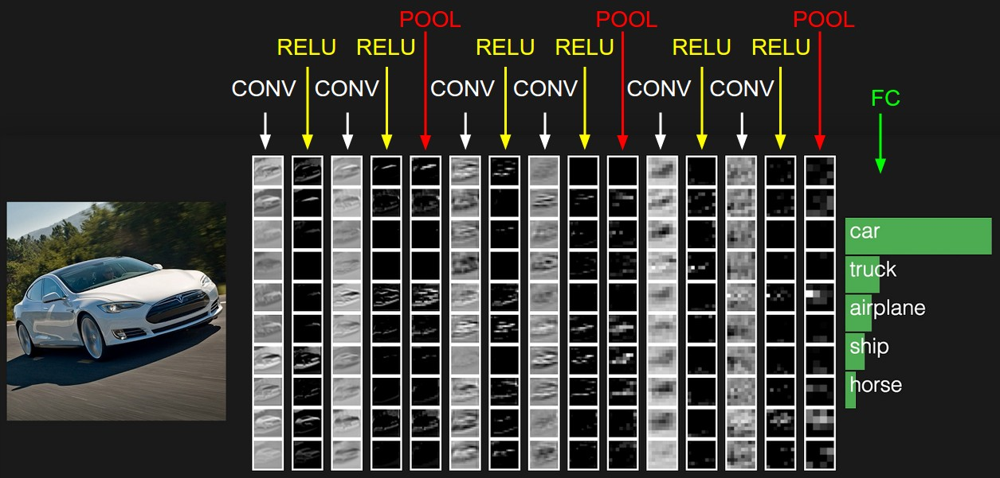

# tf-CIFAR10

A Convolutional Neural Network to classify CIFAR-10 image dataset using TensorFlow

## Files

To open the main code, simply open [`tf-cifar10.ipynb`](https://github.com/adsasmita/tf-cifar10/blob/master/tf-cifar10.ipynb) on any desktop browser, or you can download and run the cells in a Python 3 environment. The code is presented in a [Jupyter Notebook](https://github.com/jupyter/notebook) / iPython notebook for readability purposes.

## Overview

This project classifies images from the [CIFAR-10 dataset](https://www.cs.toronto.edu/~kriz/cifar.html). The dataset consists of airplanes, dogs, cats, and other objects. We will preprocess the images, then train a convolutional neural network on all the samples. The images need to be normalized and the labels need to be one-hot encoded.

## Data

The dataset is broken into batches to prevent our machine from running out of memory. The CIFAR-10 dataset consists of 5 batches, named data_batch_1, data_batch_2, etc.. Each batch contains the labels and images that are one of the following:
airplane
automobile
bird
cat
deer
dog
frog
horse
ship
truck

## Convolutional Neural Network Architecture

We are building a convolutional, max pooling, dropout, and fully connected layers. At the end, we get to see our neural network's predictions on the sample images.

## Dependencies

This project requires **Python 3** and the following Python libraries installed:

* [TensorFlow](https://www.tensorflow.org/get_started/get_started)
* [NumPy](http://www.numpy.org/)
* [tqdm](https://pypi.python.org/pypi/tqdm) - Progress Meter
* [pickle](https://docs.python.org/3/library/pickle.html)
* [helper](https://pypi.python.org/pypi/helper)

